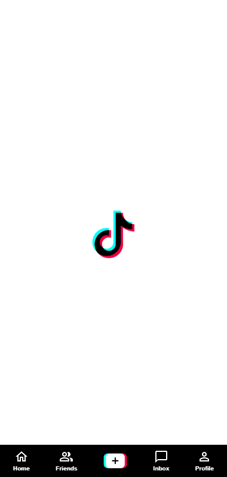
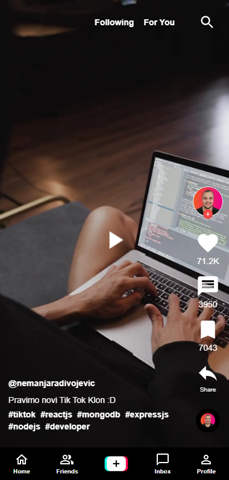
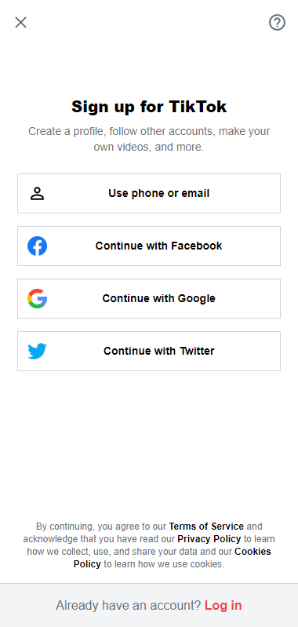

# Tik Tok Clone

<a href="https://tiktok-clone-6e39e.web.app/" target="_blank">WEBSITE LINK</a>

## Mobile Version 01

## Mobile Version 02

## Mobile Version 03

## Available Scripts

In the project directory, you can run:

### `npm start`

Runs the app in the development mode.\
Open [http://localhost:3000](http://localhost:3000) to view it in your browser.
